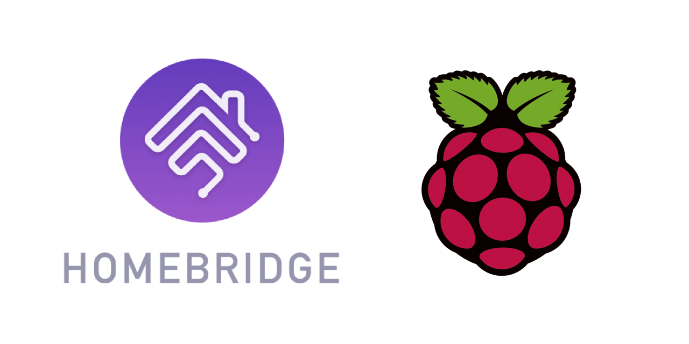

<p align="center">
    
</p>
<span align="center">

# Homebridge RPi
[](https://www.npmjs.com/package/homebridge-rpi)
[](https://www.npmjs.com/package/homebridge-rpi)
[](https://discord.gg/yGvADWt)
[](https://github.com/homebridge/homebridge/wiki/Verified-Plugins)

[](https://github.com/ebaauw/homebridge-rpi/issues)
[](https://github.com/ebaauw/homebridge-rpi/pulls)
[](https://standardjs.com)

</span>

## Homebridge plugin for Raspberry Pi
Copyright © 2019-2022 Erik Baauw. All rights reserved.

This [Homebridge](https://github.com/homebridge/homebridge) plugin exposes to HomeKit
Raspberry Pi computers and devices connected to the Pi's GPIO-pins.
It provides the following features:
- Monitoring from HomeKit of the Pi's CPU: temperature, frequency, voltage, and throttling, incl. [Eve](https://www.evehome.com/en/eve-app) history for the temperature;
- Monitoring and controlling from HomeKit of input devices connected to the Pi's GPIO pins, including:
  - Buttons;
  - Contact sensors (incl. Eve history);
- Monitoring and controlling from HomeKit output devices connected to the Pi's GPIO pins, including:
  - Relays, LEDs, Fans, etc, exposed as _Switch_ (incl. Eve history);
  - Servo motors, exposed as _Switch_, with _Current Tilt Angle_ and
_Target Tilt Angle_;
- Monitoring and controlling from HomeKit of multi-coloured LEDs of a Pimoroni
[Blinkt!](https://shop.pimoroni.com/products/blinkt) or
[Fan SHIM](https://shop.pimoroni.com/products/fan-shim), installed in the Pi.

See the [Wiki](https://github.com/ebaauw/homebridge-rpi/wiki/Supported-Devices) for an overview of supported devices.

Unlike most other Raspberry Pi plugins, Homebridge RPi runs on any regular
Homebridge setup, connecting to the Pi's `pigpiod` daemon over the network.
In particular, Homebridge RPi:
- Exposes multiple Raspberry Pi computers from one Homebridge instance;
- Does _not_ need to run on a Raspberry Pi;
- Does _not_ require any C components;
- Does _not_ require `root` privilege.

### Work in Progress
Note that this plugin is still under development.
Todo:
- Configurable timeout settings for debouncing input,
button double press and long press;
- Support NeoPixel LEDs.

Sometimes, Homebridge RPi doesn't properly close the `pigpiod` file
handles.
This can result in an `FO (104): error no handle available (-24)` error.
Use `rpi -H xx.xx.xx.xx closeHandles` to force-close the stale handles.

### Prerequisites
Homebridge RPi connects (locally or remotely) to the
[`pigpiod`](http://abyz.me.uk/rpi/pigpio/pigpiod.html) daemon
on the Raspberry Pi.
It uses the [Socket Interface](http://abyz.me.uk/rpi/pigpio/sif.html),
just as the [`pigs`](http://abyz.me.uk/rpi/pigpio/pigs.html) command.
This daemon is part of the [`pigpio`](https://github.com/joan2937/pigpio)
library, which is included in Raspbian.
While this daemon comes with Raspbian, it needs to be enabled and
configured for use by Homebridge RPi, see [**Installation**](#installation).  

If you run Homebridge in a container on the Raspberry Pi, let
Homebridge RPi connect remotely to (the `pigpiod` daemon running on) the host.
Do _not_ try to run `pigpiod` in the container.

You need a server to run Homebridge.
This can be anything running [Node.js](https://nodejs.org): from a Raspberry Pi, a NAS system, or an always-on PC running Linux, macOS, or Windows.
See the [Homebridge Wiki](https://github.com/homebridge/homebridge/wiki) for details.
I run Homebridge RPi on a Raspberry Pi 3B.

To interact with HomeKit, you need Siri or a HomeKit app on an iPhone, Apple Watch, iPad, iPod Touch, or Apple TV (4th generation or later).
I recommend to use the latest released versions of iOS, watchOS, and tvOS.  
Please note that Siri and even Apple's [Home](https://support.apple.com/en-us/HT204893) app still provide only limited HomeKit support.
To use the full features of Homebridge RPi, you might want to check out some other HomeKit apps, like the [Eve](https://www.evehome.com/en/eve-app) app (free) or Matthias Hochgatterer's [Home+](https://hochgatterer.me/home/) app (paid).

As HomeKit uses Bonjour to discover Homebridge, the server running Homebridge must be on the same subnet as your iDevices running HomeKit.
For remote access and for HomeKit automations, you need to setup an Apple TV (4th generation or later), HomePod, or iPad as [home hub](https://support.apple.com/en-us/HT207057).

### Command-Line Tool
Homebridge RPi includes a command-line tool, `rpi`,
to interact with the `pigpiod` daemon from the command line.
It takes a `-h` or `--help` argument to provide a brief overview of
its functionality and command-line arguments.

### Installation
To install Homebridge RPi:
- Follow the instructions on the [Homebridge Wiki](https://github.com/homebridge/homebridge/wiki) to install Node.js and Homebridge;
- Install the Homebridge RPi plugin through Homebridge Config UI X or manually by:
  ```
  $ sudo npm -g i homebridge-rpi
  ```
- Edit `config.json` and add the `RPi` platform provided by Homebridge RPi, see [**Homebridge Configuration**](#homebridge-configuration);
- If you want to expose devices connected to the GPIO pins on the local
Raspberry Pi, enable the `pigpiod` daemon,
see [**Local Raspberry Pi Configuration**](#local-raspberry-pi-configuration).
Note that if you run Homebridge in a container,
you need to setup the host as remote Raspberry Pi;
- If you want to expose (devices connected to the GPIO pins on) a remote
Raspberry Pi, enable and configure the `pigpiod` daemon on each remote
Raspberry Pi,
see [**Remote Raspberry Pi Configuration**](#remote-raspberry-pi-configuration).

### Homebridge Configuration
The configuration for Homebridge RPi can become rather complex, with nested
arrays of objects.
Make sure to use a JSON linter/beautifier when editing config.json.
Alternatively, edit the configuration using the Homebridge RPi settings in
Homebridge Config UI X.

#### Local Raspberry Pi
In homebridge's config.json you need to specify Homebridge RPi as a platform plugin:
```json
"platforms": [
  {
    "platform": "RPi"
  }
]
```
With this simple setup, Homebridge RPi exposes the Raspberry Pi that it runs on.
Note that this will expose nothing if you run Homebridge RPi on different
hardware, in a container, or on a virtual machine.
In those cases, configure Homebridge RPi to connect to Remote Rapyberry Pi.

The default configuration can also be specified explicitly:
```json
"platforms": [
  {
    "platform": "RPi",
    "hosts": [
      {
        "host": "127.0.0.1"
      }
    ]
  }
]
```
Make sure the user running Homebridge is a member of the `video` group.

#### Local GPIO Devices
To expose devices connected to a GPIO pin, specify a `devices` array for the host:
```json
"platforms": [
  {
    "platform": "RPi",
    "hosts": [
      {
        "host": "127.0.0.1",
        "devices": [
          {
            "device": "fanshim"
          }
        ]
      }
    ]
  }
]
```
Homebridge RPi connects to the local `pigpiod` daemon to interact with the GPIO pins.
Make sure to enable the `pidpiod` service,
see [**Local Raspberry Pi Configuration**](#local-raspberry-pi-configuration).

The example above exposes a Pimoroni Fan SHIM.
This device actually contains three different GPIO devices,
which can also be specified individually:
```json
      {
        "host": "localhost",
        "devices": [
          {
            "device": "blinkt",
            "name": "FanShim LED",
            "gpioClock": 14,
            "gpioData": 15,
            "nLeds": 1
          }
          {
            "device": "button",
            "name": "FanShim Button",
            "gpio": 17
          },
          {
            "device": "switch",
            "name": "FanShim Fan",
            "gpio": 18
          }
        ]
      }
```
See the [WiKi](https://github.com/ebaauw/homebridge-rpi/wiki/Supported-Devices)
for details about supported devices and the configuration options per device.
Note the the GPIO pins are specified by Broadcom (or BCM) number,
not by physical pin number, see the Raspberry Pi
[documentation](https://www.raspberrypi.org/documentation/usage/gpio/)
or [pinout.xyz](https://pinout.xyz).

#### Remote Raspberry Pi
To expose one or more remote Raspberry Pi computers, specify multiple entries in
the `hosts` array:
```json
"platforms": [
  {
    "platform": "RPi",
    "hosts": [
      {
        "host": "pi1"
      },
      {
        "host": "192.168.1.11",
        "name": "pi2"
      }
    ]
  }
]
```
Note that you need to configure each remote Pi for Homebridge RPi to work,
see [**Remote Raspberry Pi Configuration**](#remote-raspberry-pi-configuration) below.

#### Remote GPIO Devices
To expose devices connected to a remote Pi, specify a `devices` array for each
object in the `hosts` array:
```json
{
  "platform": "RPi",
  "hosts": [
    {
      "host": "pi1"
    },
    {
      "host": "pi2",
      "devices": [
        {
          "device": "fanshim"
        }
      ]
    },
    {
      "host": "pi3",
      "devices": [
        {
          "device": "blinkt"
        }
      ]
    },
    {
      "host": "pi4",
      "devices": [
        {
          "device": "servo",
          "name": "Robot Arm",
          "gpio": 7
        }
      ]
    }
  ]
}
```
Note that you need to configure each remote Pi for Homebridge RPi to work,
see [**Remote Raspberry Pi Configuration**](#remote-raspberry-pi-configuration) below.

### Local Raspberry Pi Configuration
Homebridge RPi uses local commands to get the state of the local Raspberry Pi.
To verify that these are working, login as the user running Homebridge and issue:
```
$ rpi info
{
  "id": "0000000069265134",
  "manufacturer": "Sony UK",
  "memory": "1GB",
  "model": "3B",
  "processor": "BCM2837",
  "revision": "1.2",
  "gpioMask": "0x0FFFFFFC",
  "gpioMaskSerial": "0x0000C000",
  "date": "2020-12-18T12:13:05.000Z",
  "boot": "2020-12-06T15:22:12.000Z",
  "powerLed": 255,
  "load": 0.04,
  "temp": 56.4,
  "freq": 600000000,
  "volt": 1.2,
  "throttled": "0x00000000"
}
```
If the user isn't a member of the `video` group, you will get an error message:
```
$ rpi info
rpi info: error: Command failed: vcgencmd measure_temp
```

If you expose devices connected to the GPIO pins on the local Raspberry Pi,
you need to enable the `pidpiod` service.

#### Enable `pigpiod` Service
Raspbian comes with a standard service for `pigpiod`,
in `/lib/systemd/system/pigpiod.service`.
By default, this service is disabled.
To enable the service, so it starts automatically on system boot, issue:
```
$ sudo systemctl enable pigpiod
```
And to start it now, issue:
```
$ sudo systemctl start pigpiod
```
To check that the service is running, issue:
```
$ pigs hwver
10494163
```
This returns the Pi's hardware revision (in decimal).

Unless you specify the local RPi as `127.0.0.1` in config.json,
`pigpiod` might see the incoming connection as a remote connection,
even though it originates from the local host.
In this case, Homebridge RPi will report an ECONNREFUSED error trying to connect to `pigpiod`.
To prevent this error, configure `pigpiod` to accept remote connections, see below.

### Remote Raspberry Pi Configuration
Note that you need to execute the following steps on each of the remote
Raspberry Pi computers you want Homebridge RPi to expose.

#### Configure `pigpiod` Service
Raspbian comes with a standard service for `pigpiod`, in
`/lib/systemd/system/pigpiod.service`.
By default `pigpiod` won't accept remote connections, due to the `-l` option.
To enable remote connections, run `sudo raspi-config` and set _Remote GPIO_ (P8)
under _Interfacing Options_ (5).
This will create a drop-in configuration in
`/etc/systemd/system/pigpiod.service.d/public.conf`, removing the `-l` option.
After that, reload the daemon by:
```
$ sudo systemctl daemon-reload
```

#### Enable `pigpiod` Service
To enable the `pigpiod` service, so it starts automatically on system boot, issue:
```
$ sudo systemctl enable pigpiod
```
And to start it now, issue:
```
$ sudo systemctl start pigpiod
```
To check that the service is running, issue:
```
$ pigs hwver
10494163
```
This returns the Pi's hardware revision (in decimal).

To check that the service is accepting remote connections, run `pigs` on
another Raspberry Pi:
```
$ PIGPIO_ADDR=xx.xx.xx.xx pigs hwver
10494163
```
substituting `xx.xx.xx.xx` with the IP address of the Raspberry Pi running
`pigpiod`.

#### Install `getState` Script
`pigpio` provides a hook to execute a shell command remotely.
Homebridge RPi uses this hook to run a little shell script,
[`getState`](./opt/pigpio/cgi/getState), that calls `date`, `uptime`, `cat` and
`vcgencmd` to get the Pi's date, uptime, system load, power LED state,
and the Pi's CPU temperature, frequency, voltage, and throttling information.
This script needs to be installed to `/opt/pigpio/cgi` by:
```
$ sudo sh -c 'cat > /opt/pigpio/cgi/getState' <<'+++'
#!/bin/bash
# homebridge-rpi/opt/pigpio/cgi/getState
# Copyright © 2019-2022 Erik Baauw.  All rights reserved.
#
# Homebridge plugin for Raspberry Pi.

umask 022
exec 2> //dev/null
exec > /tmp/getState.json

cat - <<+
{\
"date":"$(date -uIseconds)",\
"boot": "$(uptime -s)",\
"powerLed": "$(cat /sys/class/leds/led1/brightness)",\
"load":"$(uptime)",\
"temp":"$(vcgencmd measure_temp)",\
"freq":"$(vcgencmd measure_clock arm)",\
"volt":"$(vcgencmd measure_volts)",\
"throttled":"$(vcgencmd get_throttled)"\
}
+
+++
```
Next, make the script executable by:
```
$ sudo chmod 755 /opt/pigpio/cgi/getState
```
To check that the script has been installed correctly, issue:
```
$ pigs shell getState
0
```
The return status `0` indicates success.
This should have created an output file in `/tmp`:
```
$ ls -l /tmp/getState.json
-rw-r--r-- 1 root root 269 Dec 18 13:11 /tmp/getState.json
```
The `.json` file contains the script's output in JSON:
```
$ json /tmp/getState.json
{
  "date": "2020-12-18T12:11:39+00:00",
  "boot": "2020-12-06 16:22:12",
  "powerLed": "255",
  "load": " 13:11:39 up 11 days, 20:49,  2 users,  load average: 0.18, 0.11, 0.07",
  "temp": "temp=56.4'C",
  "freq": "frequency(45)=600000000",
  "volt": "volt=1.2000V",
  "throttled": "throttled=0x0"
}
```
Note that `date` is in UTC, but `boot` is in local time.

#### File Access
`pigpio` provides a hook to access files remotely.
Homebridge RPi uses this hook to get the Raspberry Pi's serial number from
`/proc/cpuinfo`, to get the output from the `getState` script, and to set the
state of the power LED through `/sys/class/leds/led1/brightness`.
These files need to be whitelisted, in `/opt/pigpio/access`:
```
$ sudo sh -c 'cat - > /opt/pigpio/access' <<+
/proc/cpuinfo r
/tmp/getState.json r
/sys/class/leds/led1/brightness w
+
```
To check that the files can be read, issue `fo` to open the file for reading:
```
$ pigs fo /tmp/getState.json 1
0
```
Note the returned file descriptor, in this case `0`.

Next issue `fr` to read up to 1024 bytes from the file descriptor, `0`, and print them as ascii:
```
$ pigs -a fr 0 1024
269 {"date":"2020-12-18T12:16:20+00:00","boot": "2020-12-06 16:22:12","powerLed": "255","load":" 13:16:20 up 11 days, 20:54,  2 users,  load average: 0.06, 0.08, 0.07","temp":"temp=55.8'C","freq":"frequency(45)=600000000","volt":"volt=1.2000V","throttled":"throttled=0x0"}
```
Lastly, make sure to close the file and free the file descriptor, `0`.
```
$ pigs fc 0
```

#### Final Check
On the server running Homebridge, issue `rpi -H `_host_` info`,
substituting the remote Pi's address or hostname.
This should return the Pi's status (serial number redacted):
```
$ rpi -H pi4 info
{
  "id": "0000000069265134",
  "manufacturer": "Sony UK",
  "memory": "1GB",
  "model": "3B",
  "processor": "BCM2837",
  "revision": "1.2",
  "gpioMask": "0x0FFFFFFC",
  "gpioMaskSerial": "0x0000C000",
  "date": "2020-12-18T12:19:16.000Z",
  "boot": "2020-12-06T15:22:12.000Z",
  "powerLed": 255,
  "load": 0.11,
  "temp": 56.4,
  "freq": 600000000,
  "volt": 1.2,
  "throttled": "0x00000000"
}
```

### Troubleshooting

#### Check Dependencies
If you run into Homebridge startup issues, please double-check what versions of Node.js and of Homebridge have been installed.
Homebridge RPi has been developed and tested using the [latest LTS](https://nodejs.org/en/about/releases/) version of Node.js and the [latest](https://www.npmjs.com/package/homebridge) version of Homebridge.
Other versions might or might not work - I simply don't have the bandwidth to test these.

#### Run Homebridge RPi Solo
If you run into Homebridge startup issues, please run a separate instance of Homebridge with only Homebridge RPi (and Homebridge Config UI X) enabled in `config.json`.
This way, you can determine whether the issue is related to Homebridge RPi itself, or to the interaction of multiple Homebridge plugins in your setup.
You can start this separate instance of Homebridge on a different system, as a different user, or from a different user directory (specified by the `-U` flag).
Make sure to use a different Homebridge `name`, `username`, and (if running on the same system) `port` in the `config.json` for each instance.

#### Debug Log File
Homebridge RPi outputs an info message for each HomeKit characteristic value it sets and for each HomeKit characteristic value change notification it receives.
When Homebridge is started with `-D`, Homebridge RPi outputs a debug message for each request it makes to `pigpiod` to change the GPIO pin status.

To capture these messages into a log file do the following:
- If you're running Homebridge as a service, stop that service;
- Run Homebridge manually, capturing the output into a file, by issuing:
  ```
  $ homebridge -CD 2>&1 | tee homebridge.log
  ```
- Interact with your devices, through their native app and or through HomeKit to trigger the issue;
- Hit interrupt (ctrl-C) to stop Homebridge;
- If you're running Homebridge as a service, restart the service;
- Compress the log file by issuing:
  ```
  $ gzip homebridge.log
  ```

#### Getting Help
If you have a question, please post a message to the **#homebridge-rpi** channel of the Homebridge community on [Discord](https://discord.gg/yGvADWt).

If you encounter a problem, please open an issue on [GitHub](https://github.com/ebaauw/homebridge-rpi/issues).
Please **attach** a copy of `homebridge.log.gz` to the issue, see [**Debug Log File**](#debug-log-file).
Please do **not** copy/paste large amounts of log output.

### Caveats
Homebridge RPi is a hobby project of mine, provided as-is, with no warranty whatsoever.  I've been running it successfully at my home for months, but your mileage might vary.

The HomeKit terminology needs some getting used to.
An _accessory_ more or less corresponds to a physical device, accessible from your iOS device over WiFi or Bluetooth.
A _bridge_ (like Homebridge) is an accessory that provides access to other, bridged, accessories.
An accessory might provide multiple _services_.
Each service corresponds to a virtual device (like a lightbulb, switch, motion sensor, ..., but also: a programmable switch button, accessory information, battery status).
Siri interacts with services, not with accessories.
A service contains one or more _characteristics_.
A characteristic is like a service attribute, which might be read or written by HomeKit apps.
You might want to checkout Apple's [HomeKit Accessory Simulator](https://developer.apple.com/documentation/homekit/testing_your_app_with_the_homekit_accessory_simulator), which is distributed as an additional tool for `Xcode`.
